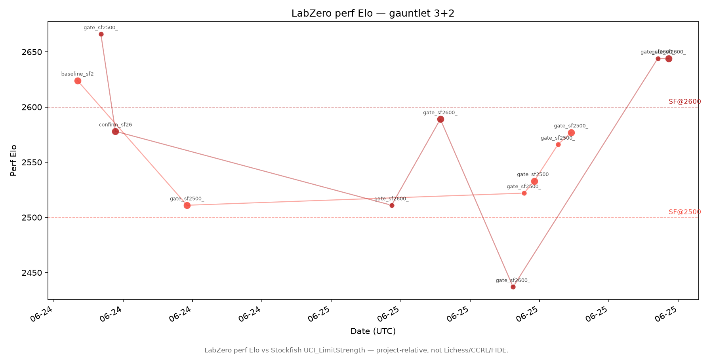

# LabZero strength timeline

LabZero perf Elo vs Stockfish UCI_LimitStrength — project-relative, not Lichess/CCRL/FIDE.

Perf Elo uses `anchor + 400*log10(p/(1-p))` when the gauntlet anchor is set.

## Static chart

## Interactive chart

Open [chart/index.html](chart/index.html) locally for hover details, protocol filters, and zoom.

## Data

Canonical series: [elo_series.csv](elo_series.csv) (79 rows).

Last updated: 2026-06-25T19:26:56 UTC
