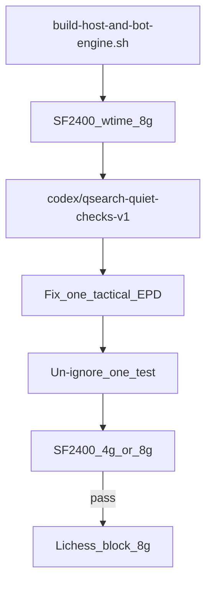

# LabZero ROI Plan (main)

Last updated: 2026-06-28. Living doc for sprint ordering after bot ops + raw-policy work on `main`.

## Consensus

The core ranking is right:

1. **Deploy freshness** — always run on a binary built from current `main`, not a stale tag copy.
2. **Small real-clock gate before rated play** — SF2400 8g is the production-readiness floor, not SF2600.
3. **One tactical EPD family at a time** — preferred over broad eval/search features. The five ignored depth-8 tests in `engine/src/search.rs` are a map, not embarrassment.

## Where main stands (2026-06-28)

| Track | State | Notes |
|-------|--------|-------|
| Bot ops | Done / tooling-complete | Draw sync, hello defer, export URL, Telegram formatting, `scripts/build-host-and-bot-engine.sh` committed |
| Engine | Unvalidated live | Raw default, score sanitizer, repetition contempt; classical-only for gates |
| Measurement | Mixed | SF2200 wtime raw 3.5/4 vs v3 0.5/3; SF2400 wtime still weak on older runs |
| Lichess | Improving | Bot fixes landed; losses still mate/rep/time patterns |

Key artifacts:

- [`docs/strength/external_opinion_brief.md`](external_opinion_brief.md) — protocol context, do-not-do list
- [`verifier/positions/tactical_losses.epd`](../../verifier/positions/tactical_losses.epd) — real-loss FEN pack
- [`lichess_bot/bot.py`](../../lichess_bot/bot.py) — Lichess bridge
- [`engine/src/search.rs`](../../engine/src/search.rs) — search, qsearch, root policy

---

## Adjustments vs earlier draft

| Earlier draft | This plan |
|---------------|-----------|
| Rebuild/copy as a new feature task | **Tooling complete** — use [`scripts/build-host-and-bot-engine.sh`](../../scripts/build-host-and-bot-engine.sh) before every Lichess session |
| Fix rep-shuffle (B) before or alongside tactical (A) | **Defer B** — raw recovered from v3; touch repetition policy again only if fresh PGNs show bad draws under raw |
| Root quiet extensions as first tactical fix | **Prefer qsearch quiet-checks v1** — narrow: quiet checking moves only, shallow qsearch, capped; targets mate-threat blindness without broad root extensions |
| Time management Tier 2 | **Second-order** — if the engine hangs queen/mate at depth 8, better clocks only give more time to blunder |

---

## ROI tiers

### Tier 1 — Ops habit (minutes, always)

**Always use the bot build script before Lichess**

```bash
./scripts/build-host-and-bot-engine.sh
```

This runs `build-host-engine.sh`, copies `target/release/labzero` to `lichess_bot/bin/labzero` and versioned names, and refreshes the legacy `labzero-macos-aarch64-*` copy on Apple Silicon.

Verify: `cargo test --manifest-path engine/Cargo.toml`; optional UCI smoke with wtime clocks.

Not a feature sprint — a **pre-flight checklist**.

### Tier 1 — Measurement gate (hours)

**SF2400 wtime 8g — new minimum sanity gate**

```bash
env -u LABZERO_NNUE -u LABZERO_NNUE_MODE -u LABZERO_NNUE_SCALE \
    -u LABZERO_POLICY -u LABZERO_POLICY_MODE -u LABZERO_EVAL_PARAMS \
    SF_ELO=2400 GAMES=8 TC_MODE=wtime TC_SEC=3 TC_INC=2 THREADS=4 DEBUG_MOVES=1 MAX_PLIES=160 \
    ./scripts/host-benchmark.sh
```

Settings: raw policy (default), classical eval only. The explicit `env -u` prefix avoids accidentally testing with stale NNUE or policy experiments enabled.

Pass bar:

- ≥4/8 W-equiv
- 0 illegal / errors / timeouts
- No repeated motifs from `tactical_losses.epd` in move traces

Why SF2400 not SF2600: at this stage SF2600 is too noisy and too flattering or traumatic depending on protocol. SF2400 3+2 real-clock is a better production-readiness check.

### Tier 2 — Next real engineering (1–2 days)

**Tactical EPD A — mate-threat blindness**

Branch: `codex/qsearch-quiet-checks-v1`

First implementation preference: **qsearch quiet checks v1**

- Only generate quiet **checking** moves in qsearch when not already in check
- Shallow qsearch only, hard cap (extend existing `QSEARCH_MAX` discipline)
- Do **not** start with root quiet extensions or broad threat extensions

Target EPDs (pick one, fix one, un-ignore one):

| Test | FEN motif | Blunder |
|------|-----------|---------|
| `tactical_loss_avoids_mate_f2f3` | mate threat | `f2f3` |
| `tactical_loss_avoids_h2h3_hang` | hangs material | `h2h3` |
| `tactical_loss_avoids_c7c5_mate` | mate threat | `c7c5` |

Preferred first fix: **`c7c5` or `f2f3`** (clear mate-threat cases).

Workflow (master prompt discipline):

1. State hypothesis + files touched (`engine/src/search.rs` only if possible)
2. Implement on branch `codex/qsearch-quiet-checks-v1`
3. Un-ignore **exactly one** passing test
4. Re-run SF2400 4g or 8g wtime
5. Only then Lichess block

### Tier 3 — Defer until evidence

| Item | Condition to revisit |
|------|---------------------|
| Rep-shuffle threshold / `ROOT_AHEAD_THRESHOLD` | Fresh PGN under **raw** shows repeated conversion → rep draw / flag |
| Time manager blitz tune (`engine/src/time.rs`) | After tactical A green; helps flags, not mates |
| `d4d3` queen fork (EPD C) | After A family improves |
| NNUE / residual training | Tactical pack passing at depth 8 |
| Root v3 | Diagnostic only; never production |
| SF2600 / freshclock strength claims | Blocked by brief |
| SMP >4 threads | NPS probes show unclear gain at depth 8; keep T=4 for Lichess |

---

## Ordered sprint (authoritative)

1. On `main`, rebuild/copy with `./scripts/build-host-and-bot-engine.sh`.
2. Run **SF2400 8g** real-clock sanity (raw, classical, `THREADS=4`).
3. Branch **`codex/qsearch-quiet-checks-v1`**.
4. Fix **one** tactical-loss family (`c7c5` or `f2f3` mate-threat preferred).
5. Un-ignore **exactly** the passing test.
6. Re-run **SF2400 4g or 8g** wtime.
7. Only then: small unrated or rated Lichess block (`--games 8`), summarize with `lichess_bot/ladder_stats.py`.



---

## What not to do

- Do not quote SF2600 or mix freshclock / 3s-host / 3min-Lichess in one strength sentence.
- Do not enable `LABZERO_ROOT_POLICY=v3` in production.
- Do not add broad search/eval features before one EPD test goes green.
- Do not scale rated volume until SF2400 8g passes (≥4/8 W-equiv).
- Do not re-tune repetition root policy without fresh raw-policy PGN evidence.

---

## Success criteria

| Metric | Target |
|--------|--------|
| Pre-Lichess | `build-host-and-bot-engine.sh` run on current `main` |
| SF2400 wtime 8g | ≥4/8 W-equiv, 0 errors |
| Tactical tests | ≥1 of 5 un-ignored and passing at depth 8 (then iterate) |
| Post-fix regate | No regression vs pre-fix 8g score |
| Lichess block | ≥50% W-equiv over 8 games; no false-draw bot exits |

---

## Changelog

- **2026-06-28** — Initial save; tuned after review: deploy = script habit, SF2400 8g gate, qsearch-quiet-checks-v1 before rep/time work.
